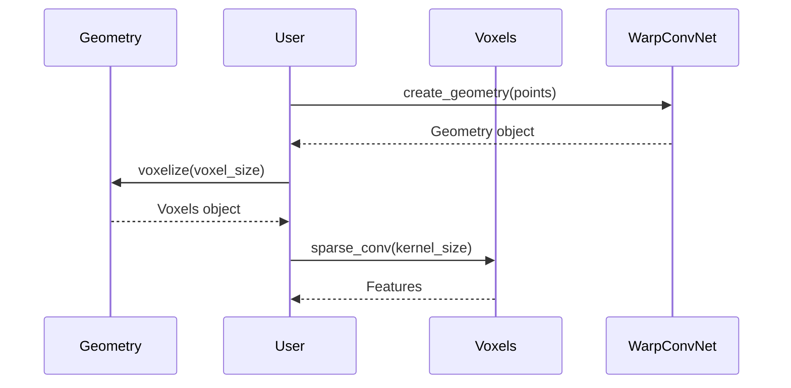

```mermaid
sequenceDiagram
    participant Geometry
    participant User
    participant Voxels
    participant WarpConvNet

    User->>WarpConvNet: create_geometry(points)
    WarpConvNet-->>User: Geometry object
    User->>Geometry: voxelize(voxel_size)
    Geometry-->>User: Voxels object
    User->>Voxels: sparse_conv(kernel_size)
    Voxels-->>User: Features
```