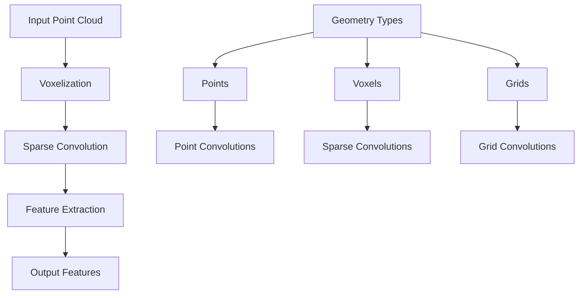

```mermaid
graph TD
    A[Input Point Cloud] --> B[Voxelization]
    B --> C[Sparse Convolution]
    C --> D[Feature Extraction]
    D --> E[Output Features]
    
    F[Geometry Types] --> G[Points]
    F --> H[Voxels]
    F --> I[Grids]
    
    G --> J[Point Convolutions]
    H --> K[Sparse Convolutions]
    I --> L[Grid Convolutions]
```