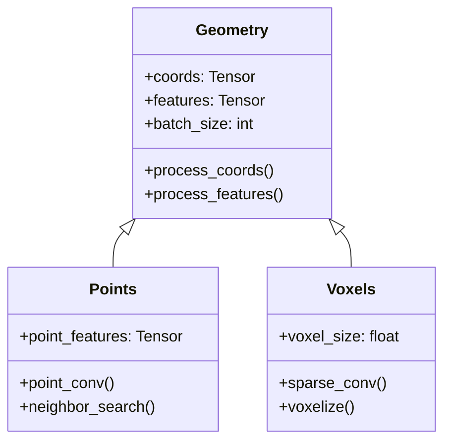

```mermaid
classDiagram
    class Geometry {
        +coords: Tensor
        +features: Tensor
        +batch_size: int
        +process_coords()
        +process_features()
    }
    class Points {
        +point_features: Tensor
        +point_conv()
        +neighbor_search()
    }
    class Voxels {
        +voxel_size: float
        +sparse_conv()
        +voxelize()
    }
    Geometry <|-- Points
    Geometry <|-- Voxels
```