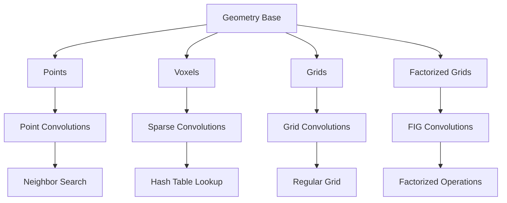

```mermaid
graph TD
    A[Geometry Base] --> B[Points]
    A --> C[Voxels]
    A --> D[Grids]
    A --> E[Factorized Grids]
    
    B --> F[Point Convolutions]
    C --> G[Sparse Convolutions]
    D --> H[Grid Convolutions]
    E --> I[FIG Convolutions]
    
    F --> J[Neighbor Search]
    G --> K[Hash Table Lookup]
    H --> L[Regular Grid]
    I --> M[Factorized Operations]
```