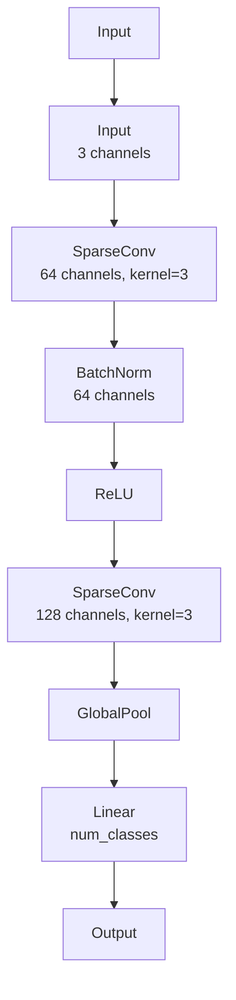

```mermaid
graph TD
    A[Input]
    B[Input<br/>3 channels]
    A --> B
    C[SparseConv<br/>64 channels, kernel=3]
    B --> C
    D[BatchNorm<br/>64 channels]
    C --> D
    E[ReLU<br/>]
    D --> E
    F[SparseConv<br/>128 channels, kernel=3]
    E --> F
    G[GlobalPool<br/>]
    F --> G
    H[Linear<br/>num_classes]
    G --> H
    I[Output]
    H --> I
```