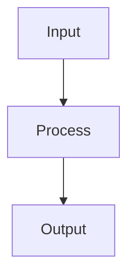

# Diagram Generation

This section contains various diagrams that illustrate the architecture and concepts of WarpConvNet.

## Architecture Diagrams

- [System Architecture](../diagrams/architecture.md) - Overview of the WarpConvNet system
- [Class Hierarchy](../diagrams/class_hierarchy.md) - Class relationships and inheritance
- [Data Flow](../diagrams/data_flow.md) - Data processing pipeline
- [Geometry Types](../diagrams/geometry_types.md) - Different geometry representations
- [Model Architecture](../diagrams/model_architecture.md) - Neural network architecture examples
- [API Sequence](../diagrams/api_sequence.md) - API usage sequence diagrams

## Using Mermaid Diagrams

The diagrams in this documentation are generated using [Mermaid](https://mermaid.js.org/), a JavaScript-based diagramming tool. You can view the source code for any diagram by clicking on it.

### Example Diagram

This allows for easy maintenance and version control of diagrams alongside the code. 